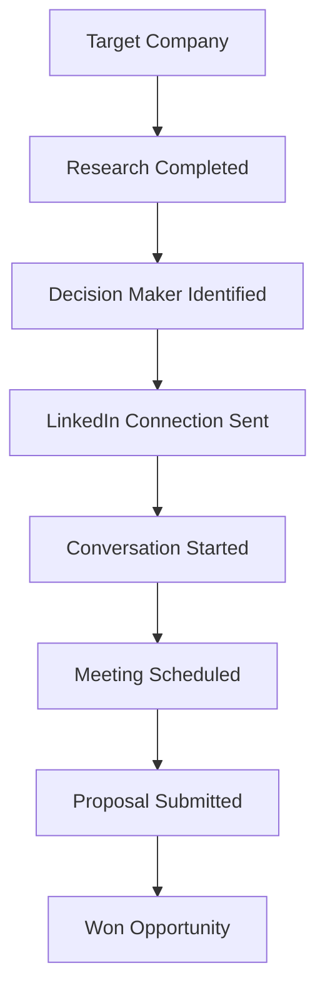

# Case Study: Building a CRM-Driven Lead Generation System for SMEs

## Background

Many SMEs struggle to generate and manage sales leads effectively. New businesses often have limited contact information available, while identifying decision-makers in established companies can be a time-consuming manual process.

Traditional approaches such as:

- Cold calling
- Manual internet research
- Spreadsheet tracking
- Generic email campaigns

often result in low conversion rates and poor visibility of sales activities.

## Challenge

The main challenges identified were:

- Limited contact information for newly registered businesses
- Time-consuming research to identify decision-makers
- Difficulty tracking multiple sales opportunities
- Inconsistent follow-up activities
- Lack of visibility across the sales pipeline

## Solution

To address these challenges, Splendid CRM was developed with a configurable pipeline management system.

The solution includes:

## Lead Generation Sources

### New Businesses

- Company registration data
- Company websites
- Industry directories

### Established Businesses

- Google Business profiles
- Industry databases
- Website research

### Decision-Maker Identification

- LinkedIn research
- Sales Navigator integration
- Contact enrichment

## Pipeline Builder

The CRM allows users to create custom sales pipelines aligned with their sales strategy.

Example pipeline:

## Why LinkedIn Became the Preferred Strategy

During testing, it became clear that:

- Cold calling required significant effort
- Generic emails had low response rates
- New companies often lacked accessible contact information

The most effective approach was:

1. Identify target companies
2. Find relevant decision-makers on LinkedIn
3. Establish professional connections
4. Build relationships
5. Convert conversations into meetings and opportunities

## CRM Features

- Custom Pipeline Builder
- Lead Management
- Contact Management
- Activity Tracking
- Follow-up Reminders
- Opportunity Management
- Sales Dashboard
- Customer Notes
- Lead Source Tracking

## Results

The CRM provides:

- A structured lead generation process
- Better visibility of sales activities
- Improved follow-up consistency
- Easier tracking of LinkedIn engagement
- Centralized customer information
- Measurable sales pipeline progress

## Key Takeaway

> "Successful B2B lead generation is not about collecting thousands of contacts. It is about identifying the right decision-maker, building relationships, and managing every interaction through a structured sales process. Splendid CRM enables businesses to create and manage these pipelines from prospect identification to opportunity closure."

## Next Step

If your team wants to improve B2B lead generation through structured pipeline workflows and better decision-maker targeting, contact Velynxia to discuss a CRM implementation tailored to your process.

- Explore CRM solutions: [/services/sales-crm](/services/sales-crm)
- Explore digital services: [/services](/services)
- Book a consultation: [/contact](/contact)
