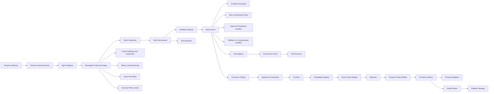

# C4 Level 3 - Component View (Agent Request Path)

## Agent Framework Components
- Request Gateway
- Tenant Context Resolver
- Agent Registry
- BaseAgent Lifecycle Engine
- Execution Logger

## Planner Components
- Intent Interpreter
- Task Decomposer
- Tool Estimator
- Workflow Selector

## Workflow Components
- Step Runner
- Condition Evaluator
- Retry and Backoff Policy
- Approval Checkpoint Handler
- Rollback or Compensation Handler

## Tool Manager Components
- Tool Registry
- Permission Guard
- Tool Executor

## RAG Components
- Connector Plugins
- Ingestion Orchestrator
- Chunker
- Embedding Adapter
- Vector Store Adapter
- Retriever
- Prompt Context Builder

## LLM Components
- Provider Interface
- Provider Adapters
- Model Router
- Fallback Strategy

## Cross-cutting Components
- Event Publisher and Subscriber
- Metrics and Monitoring
- Audit Trail Writer
- Security Policy Guard

## Diagram

