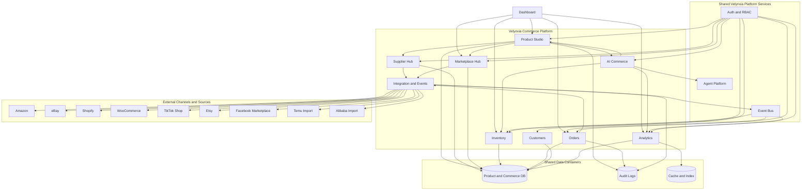

# C4 Level 2 - Commerce Platform Container View

## Containers
1. Dashboard Container
- Executive control plane and platform KPIs
- Product, commerce, operations, and business status tiles

2. Product Studio Container (Core)
- Product management and lifecycle
- Categories, brands, variants, media, attributes, specs
- Pricing, SEO, documents, approval workflow
- Canonical product entity ownership

3. Supplier Hub Container
- Supplier profiles and qualification
- MOQ, lead time, terms, certifications
- Product-supplier mappings and sourcing workflows

4. Marketplace Hub Container
- Channel adapters and publication projections
- Listing status, publish operations, synchronization orchestration
- Import adapters for external catalogs

5. Inventory Container
- Warehouses, stock balances, reservations, incoming stock
- Inventory transactions and reorder signals

6. Orders Container
- Unified order intake and status lifecycle
- Invoices, payments, shipping, returns, refunds integration points

7. Customers Container
- Customer profiles and commerce-facing customer records
- Shared identity references with Growth Platform where applicable

8. AI Commerce Container
- Product enrichment orchestration
- Pricing and margin recommendations
- Demand and inventory forecasting workflows

9. Analytics Container
- Revenue, profit, margin, conversion, channel performance
- Inventory turnover and operational health metrics

10. Integration and Events Container
- Connector contracts for marketplaces and suppliers
- Event publication/subscription with idempotency and DLQ policy

11. Shared Data Containers
- Product and commerce relational data stores
- Audit logs and workflow state
- Caching/search indexes as needed

## Runtime Notes
- Product is the canonical core; channel listings are projections.
- All container interactions are tenant-scoped and auditable.
- AI enrichment uses shared Agent Platform abstractions.
- Connector implementations must remain pluggable and replaceable.

## Diagram

