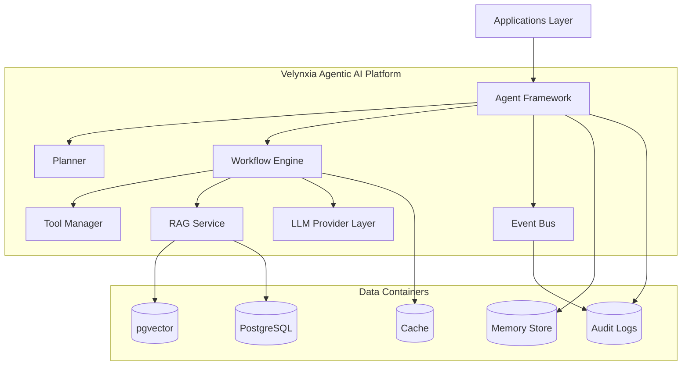

# C4 Level 2 - Container View

## Containers
1. Applications Layer
- CRM
- Sales
- Marketing
- Media
- Accounting
- Support
- Analytics

2. Agent Framework Container
- base agent lifecycle
- registry
- orchestration entry points

3. Planner Container
- goal decomposition
- agent and workflow selection

4. Workflow Engine Container
- step orchestration
- retries
- approvals
- compensation

5. Tool Manager Container
- tool registry
- tool execution adapters

6. RAG Container
- connectors
- ingestion pipeline
- retriever
- prompt context builder

7. LLM Provider Container
- model adapters
- routing and fallback policies

8. Event Bus Container
- publish and subscribe
- idempotency and DLQ handling

9. Data Containers
- PostgreSQL and pgvector
- memory stores
- audit logs
- cache

## Runtime Notes
- Must support cloud deployment and Raspberry Pi execution.
- All containers enforce tenant-scoped context.

## Diagram

