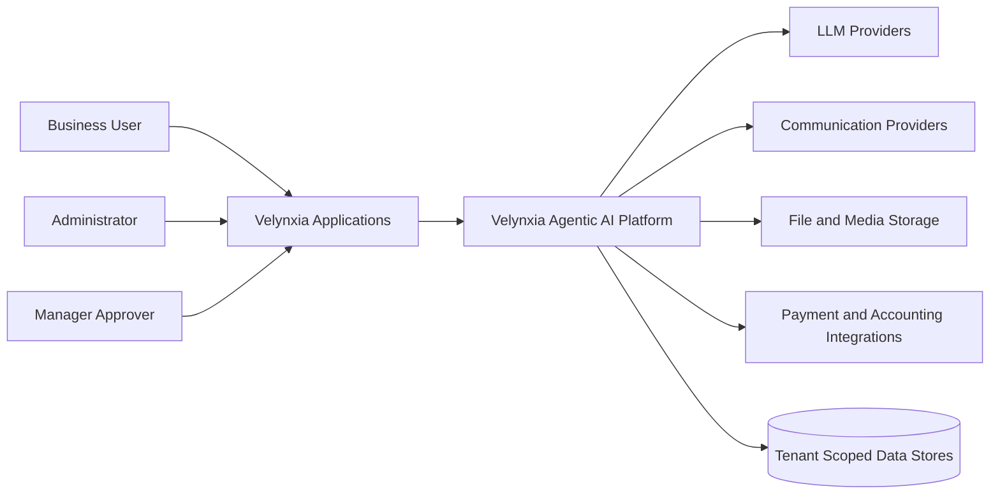

# C4 Level 1 - System Context

## Primary System
Velynxia Agentic AI Platform

## External Actors
- Business users (sales, marketing, finance, support, operations)
- Administrators
- Managers approving workflows

## External Systems
- LLM providers (OpenAI, Gemini, Claude, local model runtime)
- Communication providers (email, calendar, WhatsApp)
- File and media storage systems
- Payment and accounting integrations

## Context Summary
Velynxia applications send user intents to the shared Agentic AI platform.
The platform orchestrates planning, workflows, tools, RAG retrieval, and LLM generation.
Results and events are returned to applications and persisted in tenant-scoped stores.

## Diagram

