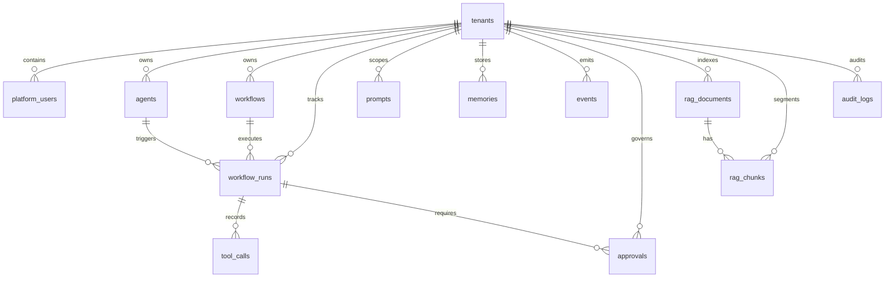

# Database Schema Blueprint - Agentic AI Platform

## Principles
- Multi-tenant first
- Auditability by default
- Replaceable provider details isolated from business objects

## Core Tables

### tenants
- id (uuid, pk)
- name
- status
- created_at
- updated_at

### platform_users
- id (uuid, pk)
- tenant_id (fk -> tenants.id)
- email
- full_name
- role
- status
- created_at
- updated_at

### agents
- id (uuid, pk)
- tenant_id (fk)
- key (unique per tenant)
- name
- description
- config_json
- enabled
- created_at
- updated_at

### workflows
- id (uuid, pk)
- tenant_id (fk)
- key (unique per tenant)
- name
- definition_json
- version
- enabled
- created_at
- updated_at

### workflow_runs
- id (uuid, pk)
- tenant_id (fk)
- workflow_id (fk)
- agent_id (fk nullable)
- correlation_id
- status
- started_at
- ended_at
- error_json nullable
- created_by_user_id (fk)

### tool_calls
- id (uuid, pk)
- tenant_id (fk)
- workflow_run_id (fk)
- tool_key
- input_json
- output_json nullable
- success
- latency_ms
- created_at

### prompts
- id (uuid, pk)
- tenant_id (fk nullable for global)
- domain
- key
- version
- template_text
- variables_json
- active
- created_at
- updated_at

### memories
- id (uuid, pk)
- tenant_id (fk)
- user_id (fk nullable)
- scope (short_term, long_term, knowledge)
- memory_key
- value_json
- created_at
- updated_at

### events
- id (uuid, pk)
- tenant_id (fk)
- name
- version
- correlation_id
- payload_json
- published_at

### event_subscriptions
- id (uuid, pk)
- tenant_id (fk nullable for global handlers)
- event_name
- handler_key
- enabled
- created_at

### approvals
- id (uuid, pk)
- tenant_id (fk)
- workflow_run_id (fk)
- level
- status (pending, approved, rejected)
- approver_user_id (fk nullable)
- reason
- decided_at nullable
- created_at

### rag_documents
- id (uuid, pk)
- tenant_id (fk)
- module
- source
- external_ref
- title
- tags_json
- version
- created_by
- created_at
- updated_at

### rag_chunks
- id (uuid, pk)
- tenant_id (fk)
- document_id (fk -> rag_documents.id)
- chunk_index
- content_text
- metadata_json
- embedding vector
- created_at
- updated_at

### audit_logs
- id (uuid, pk)
- tenant_id (fk)
- user_id (fk nullable)
- action
- resource_type
- resource_id
- before_json nullable
- after_json nullable
- correlation_id
- created_at

## Indexing Notes
- composite indexes on tenant_id + key fields
- vector index on rag_chunks.embedding (pgvector)
- correlation_id index on workflow_runs, events, audit_logs
- status indexes on workflow_runs, approvals

## Security Notes
- enforce tenant_id filters in all queries
- keep provider secrets outside table records
- support row-level security where applicable

## ER Diagram



## Starter DDL (PostgreSQL)

```sql
create table tenants (
	id uuid primary key,
	name text not null,
	status text not null,
	created_at timestamptz not null default now(),
	updated_at timestamptz not null default now()
);

create table agents (
	id uuid primary key,
	tenant_id uuid not null references tenants(id),
	key text not null,
	name text not null,
	description text,
	config_json jsonb not null,
	enabled boolean not null default true,
	created_at timestamptz not null default now(),
	updated_at timestamptz not null default now(),
	unique (tenant_id, key)
);

create table workflows (
	id uuid primary key,
	tenant_id uuid not null references tenants(id),
	key text not null,
	name text not null,
	definition_json jsonb not null,
	version text not null,
	enabled boolean not null default true,
	created_at timestamptz not null default now(),
	updated_at timestamptz not null default now(),
	unique (tenant_id, key)
);

create table workflow_runs (
	id uuid primary key,
	tenant_id uuid not null references tenants(id),
	workflow_id uuid not null references workflows(id),
	agent_id uuid references agents(id),
	correlation_id text not null,
	status text not null,
	started_at timestamptz not null,
	ended_at timestamptz,
	error_json jsonb,
	created_by_user_id uuid,
	created_at timestamptz not null default now()
);

create table events (
	id uuid primary key,
	tenant_id uuid not null references tenants(id),
	name text not null,
	version text not null,
	correlation_id text not null,
	payload_json jsonb not null,
	published_at timestamptz not null default now()
);

create table rag_documents (
	id uuid primary key,
	tenant_id uuid not null references tenants(id),
	module text not null,
	source text not null,
	external_ref text,
	title text,
	tags_json jsonb,
	version text,
	created_by text,
	created_at timestamptz not null default now(),
	updated_at timestamptz not null default now()
);

create table rag_chunks (
	id uuid primary key,
	tenant_id uuid not null references tenants(id),
	document_id uuid not null references rag_documents(id),
	chunk_index integer not null,
	content_text text not null,
	metadata_json jsonb not null,
	embedding vector(1536),
	created_at timestamptz not null default now(),
	updated_at timestamptz not null default now()
);

create table audit_logs (
	id uuid primary key,
	tenant_id uuid not null references tenants(id),
	user_id uuid,
	action text not null,
	resource_type text not null,
	resource_id text not null,
	before_json jsonb,
	after_json jsonb,
	correlation_id text,
	created_at timestamptz not null default now()
);

create index idx_workflow_runs_correlation_id on workflow_runs(correlation_id);
create index idx_events_correlation_id on events(correlation_id);
create index idx_audit_logs_correlation_id on audit_logs(correlation_id);
```
