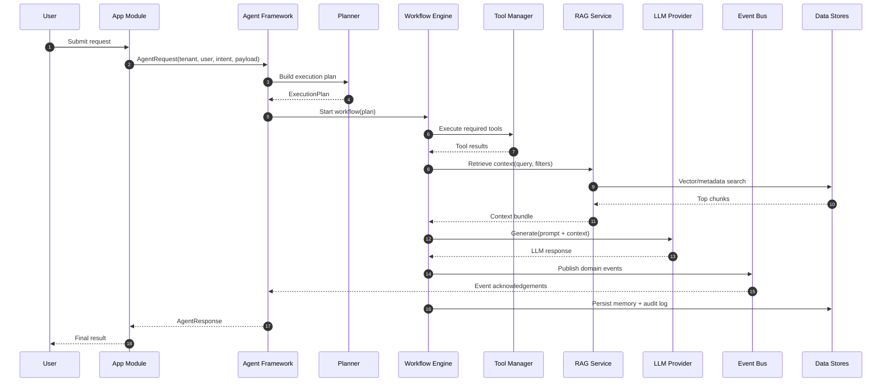

# Sequence Diagram - Agent Request Lifecycle

```mermaid
sequenceDiagram
    autonumber
    participant U as User
    participant A as App Module
    participant AF as Agent Framework
    participant P as Planner
    participant WF as Workflow Engine
    participant TM as Tool Manager
    participant R as RAG Service
    participant L as LLM Provider
    participant E as Event Bus
    participant DB as Data Stores

    U->>A: Submit request
    A->>AF: AgentRequest(tenant, user, intent, payload)
    AF->>P: Build execution plan
    P-->>AF: ExecutionPlan
    AF->>WF: Start workflow(plan)
    WF->>TM: Execute required tools
    TM-->>WF: Tool results
    WF->>R: Retrieve context(query, filters)
    R->>DB: Vector/metadata search
    DB-->>R: Top chunks
    R-->>WF: Context bundle
    WF->>L: Generate(prompt + context)
    L-->>WF: LLM response
    WF->>E: Publish domain events
    E-->>AF: Event acknowledgements
    WF->>DB: Persist memory + audit log
    AF-->>A: AgentResponse
    A-->>U: Final result
```
