# Velynxia Accounting Execution Pack

Date: 2026-06-28
Owner: Product and Engineering Leadership
Scope: 90-day execution plan, accounting domain model, UK VAT/reporting specification, and lead-to-cash-to-ledger workflow

## 1) Strategy Anchor

North-star outcome:

Enable a UK SME to run lead-to-cash-to-compliance in one platform by combining CRM, Sales, Accounting, Automation, and AI Assistant.

Product principle:

- One platform, one login, one shared customer/company model, one permission system.
- Accounting is a first-class module, not a disconnected side app.
- Financial truth comes from double-entry ledger postings only.

## 2) 90-Day Build Roadmap

### Phase 0: Setup (Week 0)

Objectives:

- Finalize architecture and accounting invariants.
- Freeze MVP scope and acceptance criteria.
- Establish delivery cadence and instrumentation.

Deliverables:

- Architecture Decision Record (ADR): ledger-first reporting.
- Definition of Done for financial features.
- Baseline product metrics dashboard.

Exit criteria:

- Team aligned on posting rules, VAT model, and reporting boundaries.

### Phase 1: Foundation and Core Transactions (Weeks 1-4)

Objectives:

- Build core accounting data model.
- Implement customer/supplier and chart of accounts.
- Implement invoices, bills, expenses, and payments with posting engine.

Deliverables:

- Chart of Accounts management with account type validation.
- Customer and supplier ledgers.
- Sales invoice lifecycle (draft, issued, partially paid, paid, void).
- Supplier bill lifecycle (draft, posted, partially paid, paid, void).
- Expense capture with VAT treatment.
- Journal posting service with balancing checks.

Exit criteria:

- Every posted document creates balanced journal entries.
- Trial balance ties to zero for all test scenarios.

### Phase 2: Bank and Reconciliation (Weeks 5-8)

Objectives:

- Ingest bank CSV data.
- Map and reconcile transactions.
- Strengthen audit trail and controls.

Deliverables:

- Bank account setup and statement import pipeline.
- Matching engine: invoice payment, bill payment, unmatched receipt/payment.
- Reconciliation screen with clear match confidence and manual override.
- Immutable audit log for transaction edits and reversals.

Exit criteria:

- Bank balance roll-forward reproducible from ledger.
- Reconciliation coverage above 90 percent for pilot data.

### Phase 3: Reporting and VAT (Weeks 9-12)

Objectives:

- Ship decision-grade finance reports.
- Deliver UK VAT-ready records and return preparation data.

Deliverables:

- Profit and Loss by month and date range.
- Balance Sheet at date.
- Trial Balance with account drill-down.
- VAT transaction summary and draft VAT return data set.
- Period lock to prevent accidental restatement.

Exit criteria:

- Reports reconcile to ledger for all seeded scenarios.
- VAT box calculations validate against known sample cases.

### Milestones and Ownership

1. Week 2: Posting engine + CoA validation complete.
2. Week 4: Invoice, bill, expense, payment flows complete.
3. Week 6: Bank import + matching complete.
4. Week 8: Reconciliation + audit trail complete.
5. Week 10: P and L, Balance Sheet, Trial Balance complete.
6. Week 12: VAT outputs + period lock + pilot readiness complete.

### Non-Negotiable Quality Gates

- No unbalanced journal entries can be persisted.
- All mutations on posted documents are reversal + repost.
- Each financial event includes traceable source document link.
- End-to-end scenario tests cover lead, quote, invoice, payment, VAT impact.

## 3) Accounting Domain Model and Posting Rules

### Core Bounded Contexts

1. Parties: customers, suppliers, contacts.
2. Accounting Master Data: chart of accounts, tax codes, fiscal periods.
3. Sales Ledger: quotes, invoices, credit notes, receipts.
4. Purchase Ledger: bills, supplier credits, payments.
5. Cash and Bank: bank accounts, statement lines, reconciliations.
6. General Ledger: journal entries, journal lines, posting engine.
7. Compliance: VAT periods, VAT return snapshots, audit trail.

### Key Entities (MVP)

- Company
- FiscalPeriod
- Account
- TaxCode
- Customer
- Supplier
- SalesInvoice
- SalesInvoiceLine
- SupplierBill
- SupplierBillLine
- ExpenseClaim
- Payment
- BankAccount
- BankTransaction
- JournalEntry
- JournalLine
- ReconciliationMatch
- AuditEvent

### Minimal Ledger Schema Rules

- JournalEntry has one source_type and source_id.
- JournalEntry has many JournalLine records.
- Sum(debit) equals Sum(credit) for each JournalEntry.
- Account currency and company base currency must be validated at posting.
- Posted entries are immutable. Corrections require reversing entry.

### Account Type Behavior

- Assets: debit increases, credit decreases.
- Liabilities: credit increases, debit decreases.
- Equity: credit increases, debit decreases.
- Revenue: credit increases, debit decreases.
- Expense: debit increases, credit decreases.

### Posting Templates (MVP)

Sales invoice (standard VAT):

1. Debit Accounts Receivable (gross)
2. Credit Sales Revenue (net)
3. Credit VAT Output (tax)

Supplier bill (standard VAT):

1. Debit Expense or Cost of Sales (net)
2. Debit VAT Input (tax)
3. Credit Accounts Payable (gross)

Customer payment received:

1. Debit Bank (amount)
2. Credit Accounts Receivable (amount)

Supplier payment made:

1. Debit Accounts Payable (amount)
2. Credit Bank (amount)

Expense paid immediately:

1. Debit Expense (net)
2. Debit VAT Input (tax if recoverable)
3. Credit Bank or Card Control (gross)

Credit note against invoice:

1. Debit Sales Revenue (net)
2. Debit VAT Output (tax)
3. Credit Accounts Receivable (gross)

### Posting Engine Requirements

- Deterministic posting key by document type + tax treatment.
- Idempotent command handling to prevent duplicate postings.
- Posting preview before commit for UI confirmation.
- Strict period validation against lock status.

## 4) UK VAT and Reporting Specification (Phase 1)

### VAT Data Requirements Per Transaction Line

- Tax point date
- Supply type (standard, reduced, zero, exempt, outside scope)
- Net amount
- VAT rate
- VAT amount
- Gross amount
- Counterparty VAT registration details when relevant
- Source document and immutable reference

### VAT Calculation Rules (MVP)

- Line-level VAT calculation with invoice-level rounding policy.
- Distinguish recoverable input VAT from non-recoverable VAT.
- Support mixed-rate documents.
- Store the applied rate and code at posting time (no dynamic re-derivation).

### VAT Return Dataset (Prepare-Only in MVP)

Generate data needed for:

1. VAT due on sales.
2. VAT due on acquisitions from other EU member states (placeholder if not used).
3. Total VAT due.
4. VAT reclaimed on purchases.
5. Net VAT to pay or reclaim.
6. Total value of sales excluding VAT.
7. Total value of purchases excluding VAT.
8. Total value of supplies to EU excluding VAT (placeholder).
9. Total value of acquisitions from EU excluding VAT (placeholder).

### Financial Reports Required (MVP)

- Profit and Loss (period and year-to-date).
- Balance Sheet (as-of date).
- Trial Balance (period and cumulative).
- Aged receivables (recommended for cash control).
- Aged payables (recommended for supplier control).

### Compliance and Control Requirements

- Full audit log for create, update, reverse, and lock events.
- Period close workflow with role-based access.
- Exportable digital records (CSV and PDF reports minimum).
- Unique sequential numbering for invoices and credit notes.

### MTD Readiness by Design

Even before direct filing support:

- Maintain digital links between source documents, journals, and VAT summaries.
- Preserve immutable VAT snapshots per return period.
- Ensure ability to regenerate VAT return dataset from ledger.

## 5) End-to-End Workflow: Lead to Cash to Ledger

### Target Flow

```mermaid
flowchart LR
    A[Lead Captured in CRM] --> B[Qualified Opportunity]
    B --> C[Quote Created]
    C --> D[Quote Accepted]
    D --> E[Sales Invoice Issued]
    E --> F[Customer Payment Received]
    F --> G[Bank Statement Imported]
    G --> H[Transaction Matched and Reconciled]
    H --> I[Ledger Updated]
    I --> J[Reports and VAT Updated]
```

### Event and Data Ownership by Module

1. CRM owns lead, account, contact, and opportunity.
2. Sales owns quote lifecycle and commercial terms.
3. Accounting owns invoice posting, payment allocation, and reconciliation.
4. Shared services own identity, permissions, company context, and audit logging.

### Critical Integration Events

- OpportunityConvertedToCustomer
- QuoteAccepted
- InvoiceIssued
- PaymentReceived
- BankTransactionImported
- ReconciliationCompleted
- FiscalPeriodLocked

### Workflow Controls

- Quote to invoice conversion keeps immutable commercial snapshot.
- Invoice issuance posts to ledger immediately.
- Payment allocation updates customer balance in real time.
- Reconciliation status gates reporting confidence indicators.

### Example State Transitions

Sales invoice:

- Draft -> Issued -> PartiallyPaid -> Paid
- Draft -> Voided
- Issued -> Credited (via credit note)

Supplier bill:

- Draft -> Posted -> PartiallyPaid -> Paid
- Draft -> Voided

Bank transaction:

- Imported -> SuggestedMatch -> Matched -> Reconciled
- Imported -> Unmatched -> SuspensePosted (optional control account)

## 6) Engineering Plan: Team, Backlog, and Test Strategy

### Suggested Squad Shape (MVP)

- 1 Product Lead
- 1 Accounting Domain Lead (or advisor)
- 2 to 3 Full-stack engineers
- 1 QA automation engineer (shared acceptable)
- 1 UX designer (part-time acceptable)

### Priority Backlog (First 30 Items)

1. Company fiscal settings and base currency
2. Chart of Accounts CRUD with guardrails
3. Tax code model and VAT rates
4. Journal entry and line schema
5. Posting engine framework
6. Customer and supplier master records
7. Invoice creation and numbering
8. Invoice posting and ledger impact
9. Bill creation and posting
10. Expense capture and posting
11. Payment receipt allocation
12. Supplier payment allocation
13. Bank account setup
14. CSV import parser and validator
15. Transaction matching rules
16. Manual reconciliation UI
17. Reversal and repost workflow
18. Audit trail service
19. Trial balance query service
20. Profit and Loss query service
21. Balance sheet query service
22. VAT transaction extraction
23. VAT summary box builder
24. Period lock and unlock workflow
25. Permissions model for finance roles
26. Customer statement export
27. Supplier remittance export
28. Error handling and suspense account flow
29. End-to-end scenario tests
30. Pilot migration templates (CSV)

### Test Matrix (Must Pass Before Pilot)

- Unit: posting templates per document type and tax code.
- Property tests: debit and credit invariants always hold.
- Integration: invoice to payment to reconciliation to report.
- Regression pack: VAT edge cases and rounding behavior.
- UAT: at least 20 realistic SME transactions covering one VAT period.

## 7) KPIs and Decision Cadence

### Product KPIs

- Time from quote acceptance to invoice issued.
- Time from payment receipt to reconciliation.
- Percentage of auto-matched bank transactions.
- Month-end close duration.
- Number of manual journal interventions.

### Delivery KPIs

- Escaped defects in financial postings.
- Reconciliation defect rate.
- Report variance defects vs expected ledger totals.

### Governance Rhythm

- Weekly: delivery review and financial correctness check.
- Biweekly: product steering against scope and timeline.
- Monthly: pilot readiness and compliance review.

## 8) Risks and Mitigations

1. Risk: building report logic outside ledger.
Mitigation: enforce ledger-derived reporting architecture by ADR and code review gate.

2. Risk: VAT complexity expands scope.
Mitigation: lock MVP to core UK VAT cases and mark edge cases as controlled exceptions.

3. Risk: weak accounting correctness in early sprint speed.
Mitigation: accounting domain lead sign-off required on every posting template.

4. Risk: platform fragmentation into separate products.
Mitigation: shared platform backlog and single identity/permissions roadmap.

## 9) Immediate Next 14 Days

1. Confirm chart of accounts baseline for pilot sectors.
2. Finalize VAT tax code table and rate effective dates.
3. Build posting engine skeleton and balancing constraints.
4. Deliver invoice and bill posting end-to-end.
5. Seed test data for one month of realistic operations.
6. Validate first P and L and trial balance outputs against expected values.

---

This execution pack assumes a UK-first SME rollout with MTD-ready records by design and direct MTD submission deferred to a later phase.